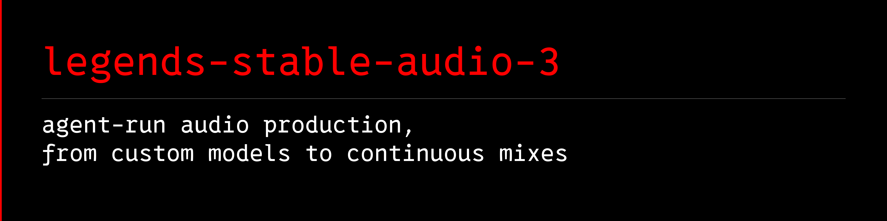

# Legends Stable Audio 3




Cross-platform agentic operator for Stable Audio 3.

Legends Stable Audio 3 is an agentic control layer that keeps local Medium,
hosted Large, the Stable Audio web studio, and downstream mixing distinct. Its
CLI handles local model access, setup, prompting, VRAM-aware planning,
generation, resumable batches, and final audio assembly. One supported workflow
can fill hours of background music by generating multiple coherent tracks and
crossfading them, but the project is not limited to long-form or background
music.

Stable Audio 3 Medium is not a Suno-style lyric-to-song system. It is strongest
for instrumental music, music beds, samples, sound effects, stems, audio-to-audio
edits, inpainting, continuation, and long-form mixes assembled from fresh
segments. It can sometimes create vocal-like textures, but it does not reliably
generate intelligible sung lyrics.

## What it does

- Helps users install the Stable Audio 3 runtime.
- Helps users download model files after they accept Stability AI's gated terms.
- Helps agents shape prompts, recipes, negative prompts, and repeatable settings.
- Detects or accepts VRAM limits and recommends practical segment lengths.
- Accepts free-form style prompts directly, with optional recipes for repeatable
  scaffolding.
- Previews expanded Stable Audio prompts before a long run.
- Generates one-off instrumental tracks or batches in Stable Audio 3-supported
  music styles.
- Manages an optional Underfit-powered LoRA Studio workflow for training custom
  Stable Audio 3 adapters.
- Supports samples, sound effects, audio-to-audio edits, inpainting, and
  continuation workflows supported by Stable Audio 3.
- Analyzes generated source tracks for quiet heads/tails before mixing.
- Optionally renders a long continuous MP3 by streaming crossfades between tracks.
- Analyzes track heads, tails, and active cue points before long MP3 assembly.
- Keeps source tracks and manifests so interrupted runs can resume.

## What it does not do

- It does not package, mirror, or redistribute Stable Audio model weights.
- It does not bypass Hugging Face gated model approval.
- It does not promise that a user's generated output is commercially safe.
  Users must read and comply with the model license and their local laws.
- It does not turn typed lyrics into clean sung songs. Stable Audio 3's official
  docs say the models do not output intelligible vocals and are not designed for
  speech or voice generation.
- `--allow-vocals` does not enable lyric singing. It only removes this wrapper's
  default instrumental bias so users can experiment with vocal-like textures.
- Its Apache-2.0 source license does not cover model weights, adapters, datasets,
  hosted services, third-party software, or generated media.

## Quick start

From a source checkout on Windows PowerShell:

```powershell
python -m venv .venv
.\.venv\Scripts\python.exe -m pip install -e ".[download]"
.\.venv\Scripts\legends-sa3.exe doctor
.\.venv\Scripts\legends-sa3.exe skill validate
.\.venv\Scripts\legends-sa3.exe download-model --model medium --output .\models\stable-audio-3-medium
.\.venv\Scripts\legends-sa3.exe plan --minutes 4 --vram-gb 24 --crossfade 12
```

On Linux or macOS:

```bash
python3 -m venv .venv
./.venv/bin/python -m pip install -e '.[download]'
./.venv/bin/legends-sa3 doctor
./.venv/bin/legends-sa3 skill validate
./.venv/bin/legends-sa3 download-model --model medium --output ./models/stable-audio-3-medium
./.venv/bin/legends-sa3 plan --minutes 4 --vram-gb 24 --crossfade 12
```

Before `download-model`, accept the Stability AI terms for the gated model and
the bundled T5Gemma conditioner, then authenticate with Hugging Face yourself.
This project never bundles weights or bypasses approval. Install the separate
`[generate]` extra only after selecting the hardware-appropriate PyTorch build;
local Medium is a supported CUDA path on Windows/Linux and a CPU fallback on
macOS, not a claimed MPS-accelerated workflow.

Preview a hosted Stable Audio 3 Large REST request without spending credits:

```powershell
legends-sa3 large plan `
  --operation text-to-audio `
  --prompt "TrackType: Music, VocalType: Instrumental, deep dub techno, 118 BPM" `
  --duration 120 --seed 42 --steps 8 --cfg-scale 1 --output-format wav
```

After verifying live Platform pricing and balance, load `STABILITY_API_KEY`
from a secret store and add `--confirmed-live-credits <n> --confirm-paid` to a
`legends-sa3 large generate` command. It submits the asynchronous job, polls the
result endpoint, downloads and hashes the audio, and writes a secret-free JSON
receipt. See the bundled `references/large-api.md` for text-to-audio,
audio-to-audio, and inpaint examples and boundaries.

The generation ID is preserved in a pending receipt before polling. Resume an
interrupted paid job with `legends-sa3 large result --generation-id <id>
--output <file>` rather than submitting it again. Existing outputs and receipts
are protected unless `--overwrite` is explicit, uploaded audio is preflighted
with `ffprobe`, and downloaded bytes are validated before writing.

Preview the prompts before spending GPU time:

```powershell
legends-sa3 prompt `
  --style "trance hip hop jazz, smoky saxophone, broken beat drums, 104 BPM" `
  --count 3
```

Generate a single prompt-guided track:

```powershell
legends-sa3 generate `
  --model-dir .\models\stable-audio-3-medium `
  --stable-audio-repo ..\stable-audio-3 `
  --style "trance hip hop jazz, smoky saxophone, broken beat drums, 104 BPM" `
  --minutes 6 `
  --vram-gb 24 `
  --output .\output\trance-hip-hop-jazz
```

Generate a long continuous background mix by sequencing many tracks:

```powershell
legends-sa3 generate `
  --model-dir .\models\stable-audio-3-medium `
  --stable-audio-repo ..\stable-audio-3 `
  --style "lo-fi study hip hop, warm Rhodes, soft boom bap drums, no vocals" `
  --hours 10 `
  --vram-gb 24 `
  --output .\output\lofi-study-10h
```

Generate with a native Stable Audio 3 LoRA or DoRA adapter:

```powershell
legends-sa3 generate `
  --model-dir .\models\stable-audio-3-medium `
  --stable-audio-repo ..\stable-audio-3 `
  --style "digital hardcore breakbeat trance, acidic bassline, no vocals, 172 BPM" `
  --minutes 6 `
  --vram-gb 24 `
  --lora-ckpt-path .\adapters\eisbach-medium\model.safetensors `
  --lora-strength 1.0 `
  --output .\output\eisbach-breakbeat-test
```

Install the optional Underfit LoRA Studio bridge:

```powershell
legends-sa3 lora-studio install
legends-sa3 lora-studio status
```

The bridge fetches only the reviewed Underfit commit
`8a96800a58c0e8b82327fc04ac31c473ed900b73` and verifies the origin, commit,
required files, and MIT license hash before execution. The default command only
checks out code. `--run-underfit-install` executes downloaded third-party shell
code that bootstraps/synchronizes Python tooling and can, with `--with-setup`,
clone runtime code or download large gated model packs. Review it first and
accept model terms yourself.

After training in Underfit, import a checkpoint into the Legends adapter
registry:

```powershell
legends-sa3 lora-studio import `
  .\state\runs\my-style\5000.safetensors `
  --name my-style `
  --source-run my-style
```

Mix an existing folder of MP3 tracks:

```powershell
legends-sa3 mix `
  --input-dir .\output\lofi-study-10h\tracks_mp3 `
  --output .\output\lofi-study-10h\lofi-study-10h-master.mp3 `
  --crossfade 12 `
  --mix-policy active-cue
```

Analyze generated source tracks before mixing:

```powershell
legends-sa3 analyze `
  --input-dir .\output\lofi-study-10h\tracks_mp3 `
  --json-output .\output\lofi-study-10h\track-analysis.json
```

## Practical Defaults

The defaults are based on the RTX 4090 24 GB test run:

- Model: `stabilityai/stable-audio-3-medium`
- Practical single-generation length: about `380s` on 24 GB VRAM
- Crossfade: `12s`
- Default mix policy: `active-cue`
- Steps: `8`
- CFG scale: `1.0`
- Output: stereo MP3, `44.1 kHz`, `320 kbps`

For lower VRAM cards, start lower:

- 8 GB: `90s` to `120s`
- 12 GB: `150s` to `180s`
- 16 GB: `210s` to `240s`
- 24 GB class: `360s` to `380s`

Run `legends-sa3 plan --hours 1 --vram-gb 16` to see the exact segment count.

## Prompt-First Workflow

Stable Audio 3 responds best to concrete musical language: genre, instruments,
mood or energy, BPM, and production character. Legends Stable Audio 3 therefore
uses free-form `--style` prompts as the primary workflow.

Recipes are optional scaffolds for repeatable batches. They are not a catalog of
everything the model can do, and users should not need a preset before asking for
something like "trance hip hop jazz" or "cinematic gospel house with breakbeats."

Current recipes:

- `lofi-study`
- `trip-hop-trance`

## Vocal And Lyric Boundary

Do not position Stable Audio 3 Medium as a lyric or clean-vocal generator.

The model can be prompted with vocal language, but its own prompting guide says it
does not output intelligible vocals. In practice, vocal prompts often produce
vocal-like pads, chants, vowel textures, or gibberish. That can be useful for
sound design, but it is not a reliable song-with-lyrics workflow.

For release examples and user-facing demos, prefer instrumental music, background
beds, samples, sound effects, solo instruments, audio-to-audio edits,
inpainting, continuation, and long MP3 mixes.

## Long-Duration Assembly

Stable Audio 3 does not create a ten-hour file in a single generation. This
operator handles that by planning multiple separate generations, keeping them in
the same creative lane, and streaming them into one master with smooth crossfades.
That gives users a practical way to create long background beds without looping
the same song for hours.

## Crossfade Quality Policy

The default `active-cue` mix policy runs per-track cue analysis before rendering:

- Trims generated near-silent dead air at source heads and tails.
- Trims quiet generated tails that would otherwise waste the overlap window.
- Keeps the first track from getting an artificial fade-up.
- Starts incoming tracks at a usable active cue so the overlap is not wasted on
  a long warmup.
- Leaves the final track without an artificial fade-down.
- Writes per-track trims and warnings into the MP3 manifest.

Use `--mix-policy strict` when you want exact raw track boundaries with only the
linear overlap crossfade. Use `--quality-gate fail` when you want the run to stop
before rendering if any track has cue-analysis warnings.

## Agent support

The canonical repository source is `skills/legends-stable-audio-3`. The wheel
ships a generated, byte-identical copy so agent installation remains available
after `pip install`. Repository mirrors are integration fixtures for source
checkouts; they are not separate skill sources and must not drift:

The installed skill also carries its own `references/` library: prompt and
duration tournaments, BPM decisions, SFX and spoken-word-bed practice, exact
Large REST request/polling flow, paid-action receipts, matched A/B boundaries, long-mix policy, adapter
escalation, licensing boundaries, and a portable mastery eval. Users do not
need this project's private development vault—or Obsidian at all—to receive the
operating method.

- Codex: `AGENTS.md` plus the `.agents/skills/` mirror.
- Grok: `GROK.md` plus the portable Agent Skills package when supported by the
  active client.
- Claude: `CLAUDE.md` plus the `.claude/skills/` mirror.
- Gemini: `GEMINI.md` plus `gemini-extension.json`.

The agent instructions all route users toward the same safe workflow:
doctor, model access, prompt planning, generate, optional mix, verify.

Validate all adapters:

```powershell
python scripts\sync_skill_adapters.py
```

Synchronize generated mirrors after editing the canonical source:

```powershell
python scripts\sync_skill_adapters.py --sync
```

After a source checkout, install the canonical package into an explicit
directory-based Agent Skills target:

```powershell
python scripts\sync_skill_adapters.py --install-target <skills-directory>
```

After installing the Python package, use the shipped bundle without needing a
repository checkout:

```powershell
legends-sa3 skill validate
legends-sa3 skill install --target <skills-directory>
```

Both installers require an explicit parent directory and refuse to replace an
existing `legends-stable-audio-3` folder. They never guess or modify global
Codex, Grok, Claude, or Gemini locations.

## Documentation

- [Model access](docs/model-access.md)
- [Prompting guide](docs/prompting-guide.md)
- [LoRA adapters](docs/lora-adapters.md)
- [LoRA Studio with Underfit](docs/lora-studio.md)
- [VRAM guide](docs/vram-guide.md)
- [Continuous mix workflow](docs/music-factory.md)
- [Agent compatibility](docs/agent-compatibility.md)
- [Windows, Linux, and macOS support](docs/platform-support.md)
- [Hosted surfaces and receipts](docs/hosted-surfaces-and-receipts.md)
- [Stable Audio 3 Large REST reference](skills/legends-stable-audio-3/references/large-api.md)
- [Commercial use and license notes](docs/commercial-use-and-license.md)
- [Apache-2.0 decision and rights record](docs/source-license-decision.md)
- [Dependency and reproducibility policy](docs/dependency-policy.md)
- [Troubleshooting](docs/troubleshooting.md)
- [Release checklist](docs/release-checklist.md)

## Status

Current package version: `v0.4.0`. The repository is in public-release
preparation; no public release is being created by this work.

Project-owned source, documentation, tests, and the current banner are licensed
under [Apache License 2.0](LICENSE). `NOTICE`, `THIRD_PARTY_NOTICES.md`, and
`assets/PROVENANCE.md` document attribution and scope. Models, weights, hosted
services, datasets, adapters, generated media, and third-party components retain
their separate terms.

Legends Stable Audio 3 is an independent compatibility project. It is not
affiliated with, sponsored by, or endorsed by Stability AI. Stability AI and
Stable Audio names identify compatible services and models; their marks remain
with their respective owners.

Repository target: `https://github.com/avalonreset/legends-stable-audio-3`.
